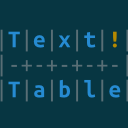
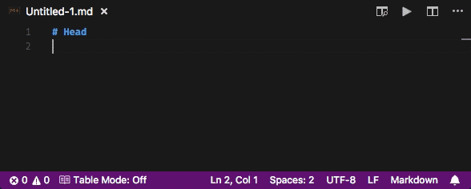
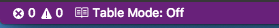
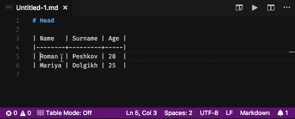

# Text Tables

[![version][version-badge]][CHANGELOG]
[![license][license-badge]][LICENSE]
[](https://travis-ci.org/rpeshkov/vscode-text-tables)



VSCode extension that brings the power of Emacs table editing.



## Features

- Tables reformat
- Easy table cells navigation
- Support for [org](https://orgmode.org/manual/Built_002din-table-editor.html#Built_002din-table-editor) and [markdown](https://help.github.com/articles/organizing-information-with-tables/) tables

## Commands

Extension provides several commands that are available in the Command Palette:

- `Text Tables: Create table` - create new table in cursor position.
- `Text Tables: Format under cursor` - reformat the table under cursor.
- `Text Tables: Enter table mode` - enter [table mode](#table-mode).
- `Text Tables: Exit table mode` - exit [table mode](#table-mode).
- `Text Tables: Go to next cell` - switch to next cell in current table.
- `Text Tables: Go to previous cell` - switch to previous cell in current table.

You can access all of the above commands from the command pallete (<kbd>Ctrl</kbd>+<kbd>Shift</kbd>+<kbd>p</kbd> or <kbd>Cmd</kbd>+<kbd>Shift</kbd>+<kbd>p</kbd>)

## Table mode

Table mode is the mode where some of the default keybindings have another action assigned.

To enter table mode you may execute command `Text Tables: Enter table mode` from command palette or press <kbd>Ctrl</kbd>+<kbd>q</kbd> <kbd>Ctrl</kbd>+<kbd>q</kbd> shortcut to toggle mode. To control whether you're in table mode or not, see the icon in the status bar of Visual Studio Code:



When in table mode, <kbd>Tab</kbd> and <kbd>Shift</kbd>+<kbd>Tab</kbd> keybindings will navigate next/previous cell accordingly.



## Keybindings

- <kbd>Ctrl</kbd>+<kbd>q</kbd> <kbd>f</kbd> - format table under cursor.
- <kbd>Ctrl</kbd>+<kbd>q</kbd> <kbd>Ctrl</kbd>+<kbd>q</kbd> - toggle table mode.

### In table mode

- <kbd>Tab</kbd> - navigate to the next cell in table.
- <kbd>Shift</kbd>+<kbd>Tab</kbd> - navigate to the previous cell in table.

### Custom keybindings

Extension introduces additional `tableMode` when-clause that you may use to define your own keybindings when in table mode.

Sample keybinding:

```json
{
    "key": "tab",
    "command": "text-tables.gotoNextCell",
    "when": "tableMode"
}
```

## Settings

This extension introduces some settings that you may setup in your user settings or workspace settings.

Available settings:

- `text-tables.mode` - sets the type of tables. Valid values are: `org` and `markdown`.

## Contribution

All contributions are welcome.

If you found a bug or want to propose new feature for the extension, feel free to create an issue.

[CHANGELOG]: ./CHANGELOG.md
[LICENSE]: ./LICENSE
[version-badge]: https://img.shields.io/badge/version-0.0.2-blue.svg
[license-badge]: https://img.shields.io/badge/license-MIT-blue.svg
